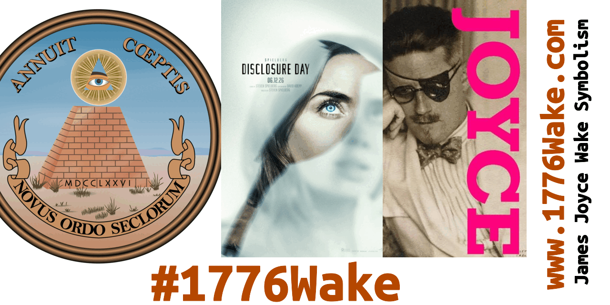

# Left-Eye Right-Eye Third-Eye: Disclosure Day *We*

&nbsp;

# What Do *We See*

Page 581, Finnegans Wake, by James Joyce    
https://www.finnegansweb.com/wiki/index.php/Page_581    

At the carryfour with awlus plawshus, their happy-    
ass cloudious! And then and too the trivials! And their bivouac!    
**And his monomyth! Ah ho! Say no more about it! I'm sorry!    
I saw. I'm sorry! I'm sorry to say I saw!**    
Gives there not too amongst us after all events    

&nbsp;

&nbsp;

# Not Two Amongst Us

NEW_OPERA_NAME #FWakeAmongst #Amongst #AmongstUs #TooAmongst #Too2TwoTo #FWakeToo2TwoTo    
https://bsky.app/profile/greatsealusa.bsky.social/post/3mpbtaietz22k    
https://autistics.life/@RoundSparrow/116822908868324550    

&nbsp;

" not too amongst us after all events " - Page 581, Finnegans Wake, James Joyce   
May 4, 1939 https://www.finnegansweb.com/wiki/index.php/Page_581   

#DisclosureDayUSA Disclosure Day USA. June 12, 2026    

#FWakeAmongst #Amongst #AmongstUs    
#TooAmongst #Too2TwoTo #FWakeToo2TwoTo /\    

&nbsp;

&mbsp;

# Stories are making and breaking lives

Steven Spielberg metaphors are aiming very high. Not to make money, but to face the organizations that keep secrets, the organized secrecy.

&nbsp;

BILL MOYERS: Or he goes to the movies.

JOSEPH CAMPBELL: That might be our counterpart to mythological re-enactments -- except that we don't have the same kind of thinking going into the production of a movie that goes into the production of an initiation ritual.

BILL MOYERS: No, but given the absence of initiation rituals, which have largely disappeared from our society, the world of imagination as projected on that screen serves, even if in a faulty way, to tell that story, doesn't it?

JOSEPH CAMPBELL: Yes, but what is unfortunate for us is that a lot of the people who write these stories do not have the **sense of their responsibility. These stories are making and breaking lives. But the movies are made simply to make money. The kind of responsibility that goes into a priesthood** with a ritual is not there. That is one of our problems today.

Published year 1988. Nonfiction book. https://en.wikipedia.org/wiki/Joseph_Campbell_and_the_Power_of_Myth
