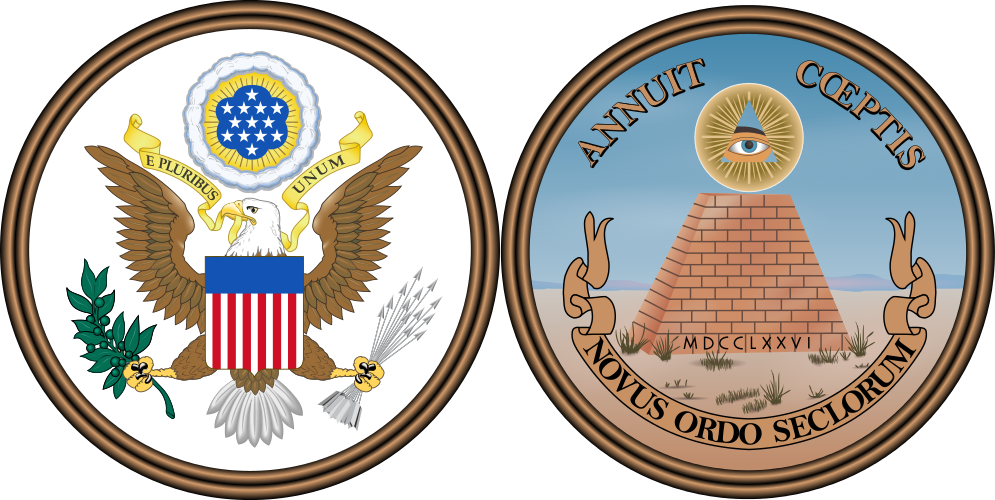
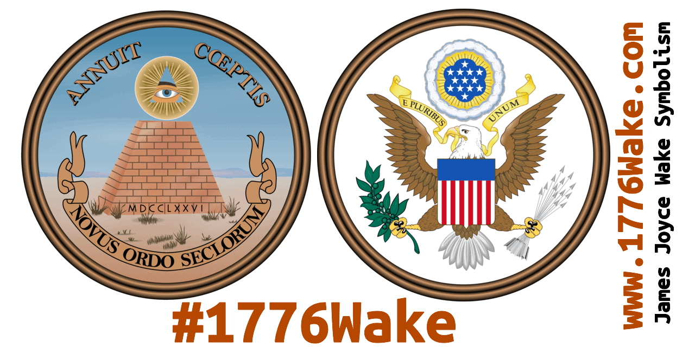

# 1776Wake

1776 Wake / www.1776Wake.com - Woke, Wake, Progress, [Learning from Mistakes](/Learn_Mistakes_USA/Learn_Mistakes_USA_Girls_Women.md) - Finnegans Wake to read the 1776 Founding Fathers properly. Irish author James Joyce's Finnegans Wake book is the greatest tool to better understand the United States of America ideals and concepts of art symbolism.

&nbsp;

# Media Study

"Finnegans **Wake** is the greatest **guidebook to media study** ever fashioned by man." - Marshall McLuhan, Newsweek Magazine, page 56, February 28, 1966

* “History, Stephen said, is **a nightmare from which I am trying to awake**.”
― James Joyce, Ulysses, [Episode 2: Nestor, Page 34](https://en.wikisource.org/wiki/Ulysses_(1922)/Chapter_2)
   * Streaming print, partially serialised in the American journal The Little Review from March 1918 to December 1920
   * The complete book was published February 2, 1922 on James Joyce's 40th birthday.
   * Another recommended source for the quote: https://www.JoyceProject.com/2

&nbsp;

&nbsp;

------------------------------

&nbsp;

&nbsp;

&nbsp;

&nbsp;

# License

License: Public Domain. No Rights Reserved.
